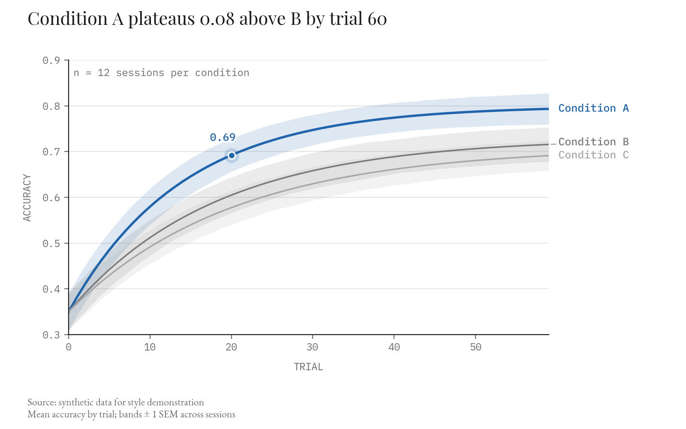
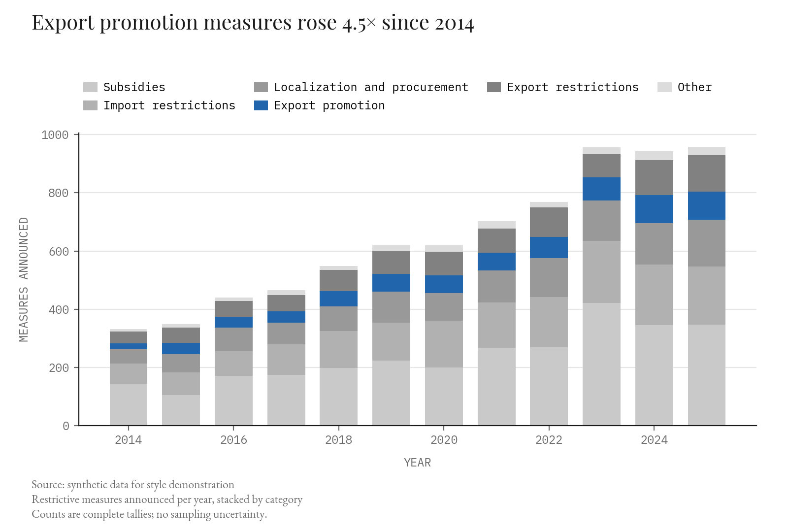
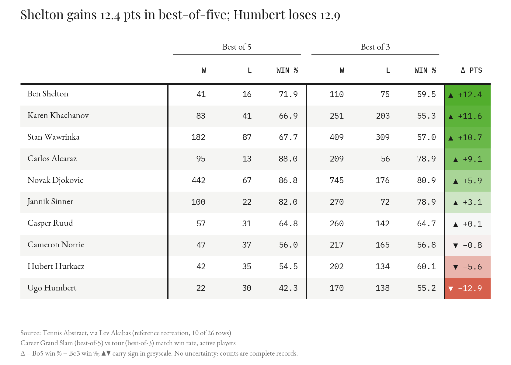

# Plotting style guide

The house style for every figure, table and chart, in any project. It is distilled
from the ~80 references in [`source/`](source/), each catalogued with what to borrow
and what to avoid in [REFERENCES.md](REFERENCES.md); IDs like **T1** or **L6** below
point there.

**Layering.** This file is general. A project guide in [`project_style/`](project_style/)
may override a rule only by naming it; anything it doesn't name, this file governs.

| Project guide | Scope |
|---|---|
| [project_style/columbia_nhp.md](project_style/columbia_nhp.md) | Columbia NHP neurophysiology: valence palette, journal typography profile, raster/PSTH, PCA and panel conventions |

**Code.** [`examples/make_examples.py`](examples/make_examples.py) holds every recipe
this guide quotes (tokens, `title`, `bottom_block`, `axis_label`, `key_dot`,
`direct_labels`, `legend_band`, `draw_table`, `check_text_overlap`). Running it
renders the reference PNG/SVGs in `examples/` and **fails if any text overlaps or
leaves the canvas**. Import from it or copy it verbatim. `plot_style.py`, which the
global agent rules name, does not exist yet; until it does, `make_examples.py` is the
baseline.

---

## 1. Principles

1. **One figure, one claim.** The title states the claim, and the data-derived number
   in it is computed, never typed in by hand.
2. **Label the data, not a key.** Direct labels first; a legend is a fallback (§6).
3. **Nothing overlaps, nothing is clipped.** This is checked on the rendered image,
   never argued from the code (§5, §11).
4. **Show the spread.** Every estimate carries its variance, and every panel shows its n (§8).
5. **Gray by default, color on purpose.** One accent for the subject of the claim;
   green and red only for signed change (§3).
6. **Whitespace is structure.** Gaps come from a fixed spacing scale; crowding is a
   bug, even when nothing technically overlaps.

## 2. Anatomy of a figure

Top to bottom, left-aligned to one margin (x = 0.04 of figure width):

```
┌────────────────────────────────────────────────────────────┐
│ ▬  (optional accent tag bar, E3)                           │
│ Title stating the claim with its number        ← Playfair  │
│                                        ↕ ≥ 18 pt           │
│ ■ Legend band (only if direct labels can't work) ← mono    │
│                                        ↕ ≥ 12 pt           │
│ ┌──────────────────────────────────────┐                   │
│ │ plot area                            │ Direct labels     │
│ │                                      │ in reserved right │
│ └──────────────────────────────────────┘ margin            │
│   AXIS LABEL (mono, uppercase)         ↕ ≥ 18 pt           │
│ Source: …                                  ← EB Garamond   │
│ Descriptive line (what is plotted, units, variance form)   │
│ Notes: exclusions, missing data, why no error bars         │
└────────────────────────────────────────────────────────────┘
```

- **No subtitle under the title.** The descriptive line goes in the bottom block, under
  the source (`bottom_block`). Nearly every news reference puts a subtitle under the
  title; we deliberately don't, so the title-to-data distance stays short.
- **Tick labels go at the extremes of repeated panels.** In a stack of small
  multiples, x tick labels appear only on the first and last panel (L1).
- **A unit written once.** Put it on the axis label, or on the top tick only
  ("$80 billion", B2), never on every tick.
- **Publisher-style mark** (if any) goes bottom-right, on the source line's baseline (E2).

## 3. Color

| Token | Hex | Use |
|---|---|---|
| `INK` | `#1a1a1a` | Titles, primary text, heavy rules, zero lines |
| `MUTED` | `#6b6b6b` | Tick labels, axis labels, bottom block, secondary text |
| `FAINT` | `#b8b8b8` | Context series, closing rules |
| `GRID` | `#e6e6e6` | Gridlines (y only by default) |
| `ZEBRA` | `#f5f5f3` | Alternate table rows |
| `ACCENT` | `#2166ac` | The one series or point the title is about |
| `POS` | `#4dac26` | Positive signed change |
| `NEG` | `#d6604d` | Negative signed change |

- **Categorical:** the accent plus grays stepped in lightness (B1 shows why: seven equal
  hues make every category shout). If several categories genuinely need hue, use at
  most five, and give each a second channel: position, direct label, marker or dash.
- **Sequential:** a single hue, light to dark (T3, E13). Never a rainbow.
- **Diverging:** centred at a meaningful zero (`TwoSlopeNorm(vcenter=0)`), symmetric
  limits, near-white centre (T1, S3, S5). Green/red when the quantity is a signed
  change; blue/red for correlation-like quantities.
- **Signed change always has a second channel:** ▲▼ glyphs, a `+`/`−` sign, or a
  position relative to a zero line. Color alone fails in greyscale print and for
  red–green color blindness.
- **Color the words.** When the title or a caption names a series, color that word
  in the series color (L2, B8, E7). This often removes the legend entirely.
- **Text on fills** flips to white when the fill's relative luminance is < 0.55
  (`_luminance` in `make_examples.py`).
- Backgrounds are white. A dark or tinted page is a deliberate editorial choice, not
  a default (E8).

## 4. Typography

| Tier | Family | Size (at final print size) | Notes |
|---|---|---|---|
| Title | Playfair Display, bold | 14–16 pt | Left-aligned, sentence case, states the finding |
| Spanner / panel title | EB Garamond, semibold | 10–11 pt | Never italic |
| Prose on the figure (annotations, bottom block, row labels) | EB Garamond | 8.5–10.5 pt | **Never italic**, not even for "no data" notes (L7) |
| Every numeral: ticks, values, table cells, n= | IBM Plex Mono | 8.5–9.5 pt | Fallback list `["IBM Plex Mono", "Menlo", "DejaVu Sans Mono"]`; a bare family renders tofu for `± σ Δ ▲▼` |
| Axis labels, column headers, kickers | IBM Plex Mono, UPPERCASE | 8.5 pt | Every axis gets a label, always |

- **Nothing below 8 pt at the size the figure is actually printed or shown.**
  Tiny annotations (L3's 5-pt `n:` note, N8's legends) are the most common way a
  "clean" figure fails.
- Use a true minus `−` (U+2212), not a hyphen, in values and ticks.
- Playfair defaults to old-style figures (the digits in `4.5×` sit low). matplotlib
  can't switch on lining figures, so accept this in titles; everywhere else numerals
  are mono.
- **Casing:** text drawn inside the axes gets the white stroke `CASING`
  (`patheffects.withStroke(linewidth=3, foreground="white")`), so it reads the same
  over lines, bands and fills.
- After installing a font, rebuild matplotlib's cache:
  `fm._load_fontmanager(try_read_cache=False)`. A stale cache silently falls back to DejaVu.

## 5. Spacing and layout

All gaps come from one scale, in points: `SP = {xs: 2, s: 4, m: 8, l: 12, xl: 18, xxl: 28}`.

| Gap | Minimum |
|---|---|
| Title → legend band or plot top | `xl` 18 pt |
| Legend band → axes top | `l` 12 pt (`legend_band(gap_pt=…)`) |
| Axis label → tick labels | `m` 8 pt (`labelpad`) |
| Line end → its direct label | `m` 8 pt |
| Between stacked direct labels (baseline to baseline) | 1.2 × font size (≈ 11 pt at 9 pt) |
| Any two text boxes | `s` 4 pt clear, measured on the render |
| Between panels (gutter) | `xxl` 28 pt, or the widest tick label + `l`, whichever is larger |
| Plot bottom (x-axis label) → bottom block | `xl` 18 pt |
| Figure edge → any ink | 0.04 of figure width |
| Table row height | ≥ 1.8 × body font size |

**Reserve space before drawing, don't squeeze afterwards.** Set the axes rectangle
explicitly (`fig.add_axes([l, b, w, h])`), with a right margin wide enough for direct
labels and a top band for the legend. `tight_layout` / `constrained_layout` don't
know about annotations placed with offsets, so they will pack text into your gaps.

**Crowding fixes, in order of preference:**

1. Long category labels → **horizontal bars** so labels read left to right (fixes B7,
   D5, S3, S4). **Never rotate tick labels.** 45° text is the most common crowding
   pattern in the references, and every instance is fixable by a swap.
2. Too many ticks → thin them (`ax.set_xticks(x[::2])`), or abbreviate years ('45 ‒ '25, L13).
3. Too many panels → split the figure. A Figure-3-style atlas (N1) is a style
   vocabulary, not a page layout to copy.
4. Last resort: enlarge the figure. Never shrink type below 8 pt.

## 6. Legends and labels

Use the **first** option that works:

1. **Direct labels** at line ends or beside the last bar, in the series color, bold
   mono (L2, L4, L5, B5). `direct_labels(ax, ends)` sorts end labels by y, pushes
   neighbours apart to the minimum gap, slides the stack down if it overruns the top,
   and draws a thin leader to the true endpoint for any label it moved.
2. **Colored words** in the title or a caption (B8, D6, E7): the legend becomes the prose.
3. **A legend band** above the axes, outside the plot (B6, E4). `legend_band` begins
   with all entries on one row and removes columns until the legend fits inside the
   side margins, so **entries wrap whole**. B1's "Export / restrictions" break is the
   failure this prevents.
4. **A reserved right-margin column**, one entry per line, for long lists or stacked
   panels that share one key (the raster/PSTH case).
5. **Inside the axes** only in a region that is provably empty *for all data*, confirmed
   on the render (B7, D5). **Never `loc="best"`.** It picks a spot based on today's
   data and silently overlaps tomorrow's.

| Option 1: `direct_labels` + `key_dot` | Option 3: `legend_band` |
|---|---|
|  |  |

Rules for any legend:

- Order entries as the marks are stacked or ranked visually (top of stack = top of legend).
- The glyph must match the mark: a line for lines, a square for fills, and for
  composite glyphs, a miniature of the glyph itself (D5's percentile key, S1's nested
  size circles).
- No redundant legend: if the x-ticks already name the groups, drop it (D1).
- No frame, and no title unless the variable name isn't obvious (N5 "Value").

**Point and annotation labels:**

- Label a **subset**: the highlight, the extremes, the ones the text mentions. Labeling
  everything guarantees collisions (S2, S7, L15).
- A crowded label moves into whitespace and gets a curved leader (S1, B4) or an
  orthogonal leader to an aligned list (E5).
- Threshold/reference lines are labeled at the left end, above the line and clear of
  data. If two thresholds sit closer than 1.2 × font size, merge their labels
  ("M7–M8") rather than stacking them (L3).
- If a label can't be placed without overlap, **drop it** and mention it in the notes
  line. An overlapping label is worse than a missing one.

## 7. Annotation vocabulary

| Need | Device | Ref |
|---|---|---|
| The one point the title is about | `key_dot`: halo dot + bold mono value | L9, E1 |
| An event in time | Dotted vertical rule through all panels, labeled **once** above the plot area; stack labels with leaders when events cluster | L1, L6 |
| A period or regime | Pale shaded band, labeled at its base | L9, N5 |
| A gap between two series | Shade between them + a bracket with the magnitude | L8 |
| Direction of an axis | Arrow captions under or beside the axis ("↑ Stretched capacity", "← Lower  Higher →") | B3, S2 |
| One bar or segment under discussion | Outline in `INK`, two-line label (name bold, value regular) | B4, E4 |
| Missing data | Gap in the line + a muted, **upright** note in place | L7 |
| Off-scale value | Broken bar (slash) with the true value printed | B9 |
| Summary statistic of a panel | Boxed badge in a corner: `diag: 0.97`, `r = 0.53` | S5, N5 |
| Sample size | `n = …` in the panel, or n rows aligned under the categories | D2, N6 |
| Signed difference between two series | A separate difference panel beneath, sharing x, with both sides named | L15, D6 |

## 8. Variance

Mandatory. Pick the form that matches the data:

| Data | Show |
|---|---|
| Time series of a mean | Band (± SEM or CI) in the series color at ~15% alpha; state which in the bottom block |
| Group means | Capped error bars **plus** the observations when n ≤ ~50 |
| Distributions | Raincloud or split violin with points (D1, D2); overlaid step histograms (D3, D6) |
| Many rows of a distribution | Quantile dot plot (D5) or range bar + points (D4) |
| Smoothed estimate | Raw observations as faint dots behind it (L6) |
| Complete counts / records | State "no sampling uncertainty" in the notes line |

Every panel carries its n. Every reported number carries its uncertainty
(`mean ± sd` or `median [IQR]`), or the notes line says why it can't.

## 9. Tables

Tables are figures. The reference is **T1**:



**Structure**

- **Rules mark structure, not cells.** Use a heavy rule (1.8 pt, `INK`) under the header,
  heavy vertical rules (1.4 pt) **between column groups** and after the row-label column,
  and a light closing rule (0.8 pt, `FAINT`). Put no rule between rows or between the
  columns within a group; zebra (`ZEBRA`) does that work.
- **Spanner headers** name each group, centred over it with a thin underline (T2).
- Column headers: mono, uppercase, bold, aligned the same way as their column.
- Row labels: EB Garamond semibold, left-aligned. Put secondary context
  (affiliation, unit, n) on a small muted second line (T2).
- Row height ≥ 1.8 × body size; cell padding ≥ `SP["s"]` on both sides.

**Numbers**

- Mono, **right-aligned**, with the same number of decimals throughout a column,
  so the digits line up.
- True minus `−`; explicit `+` on signed columns; thousands separators on counts ≥ 10,000.
- Structurally empty → `–` (T3). Zero → `0`. Unknown → a code defined in a footnote (T2 "UR").
- Two-value cells (estimate + odds, mean + sd): primary on top in regular weight,
  secondary below it, smaller and muted (T3). Check the contrast on filled cells.

**Conditional formatting**

- Condition **one** column (the one the title is about), or one block of homogeneous
  columns. Filling the whole grid only makes sense when the table *is* a heatmap (T2).
- Signed columns: a diverging green/red fill centred at 0 with symmetric limits,
  plus ▲▼ glyphs. Magnitude columns: a single-hue sequential fill.
- Text flips to white on dark fills; a filled cell keeps the same padding and
  alignment as an unfilled one.
- Sort rows by the conditioned column unless the rows have an intrinsic order.

`draw_table(ax, rows, columns, groups, delta_key, fmt)` implements all of this in
matplotlib. For HTML tables (dashboards, artifacts) apply the same rules:

```css
table { border-collapse: collapse; font-variant-numeric: tabular-nums; }
thead th { border-bottom: 2px solid var(--ink); text-transform: uppercase; }
td.num, th.num { text-align: right; font-family: "IBM Plex Mono", Menlo, monospace; }
td.group-start, th.group-start { border-left: 2px solid var(--ink); }
tbody tr:nth-child(even) { background: var(--zebra); }
tbody tr:last-child td { border-bottom: 1px solid var(--faint); }
```

Then render the page and run `checkLayoutOverlap('#table')`
(`metapod/scripts/check_layout_overlap.js`).

## 10. Form by task

| Task | Form | Refs |
|---|---|---|
| Change over time, few series | Lines, direct-labeled, context in gray | L2, L4, L5 |
| Change over time, many entities | Small multiples with shared axes, end values labeled | L1, L10, B6 |
| Parts of a whole over time | Stacked bars/area, the accent on the part that matters, and a total line if signed | B1, B3, B10 |
| Two conditions per entity | Dumbbell or slope; Δ column in a table | T1 |
| Ranking | Sorted horizontal bars, or a table with a conditioned rank column | T4, B7 |
| Distribution comparison | Raincloud / split violin with n rows | D1, D2 |
| Distribution across many rows | Quantile dot plot sorted by median | D5 |
| Two continuous variables | Scatter with labeled highlights; bubbles only with a size key | S1, S2 |
| Matrix | Heatmap, grouped rows separated by gaps, shared colorbar, labels horizontal | S4, S5 |
| Before → after states | Grid table with arrows | T5 |
| Entity × period presence | Tile calendar with numbers inside | T6 |
| Many events over a year | Ridgeline sorted by peak | L16 |
| Lifespans and eras | Timeline bars with name + dates | E10 |

**Avoid:** pie, donut and sunburst for comparison (angle is read poorly; donuts are fine
only to carry an n in the centre, N6); treemaps; radar charts (use bars); 3-D without
tick values; dual y-axes with unrelated units (B11); pictograms that overplot (B12).

## 11. Interactive charts

Plotly for standalone Python; Bokeh inside metapod; vanilla JS/CSS (D3 only when the
geometry demands it) for web timelines. Never Altair, Vega, Chart.js, vis.js or timeline.js.

- **Click or hover a legend entry to dim the others to ~25%** instead of hiding them (B1).
- Toggles between states are filled chips; the selected state is obvious without color (L12).
- Tooltips are micro-tables: a colored left border as the key, the value in bold mono,
  counts muted (T7).
- Cursor: `pointer` for clickable elements, `default` for hover tips. Never `help`.
- The static state must work on its own: direct labels are still present before any hover.

## 12. Pre-ship checklist

Check it against the **rendered PNG**, not against the code.

- [ ] `check_text_overlap(fig)` returns `[]` (or `save()` in `make_examples.py` passes).
      For HTML: `checkLayoutOverlap` reports no clipped, overlapping or page-overflow items.
- [ ] Opened the PNG and looked at it at 100% zoom.
- [ ] Title states the claim; its number is computed from the plotted data.
- [ ] No subtitle; the bottom block has source, descriptive line, and notes where needed.
- [ ] Every axis labeled, mono, uppercase, with units.
- [ ] No rotated tick labels; nothing below 8 pt; no italic.
- [ ] Legend follows the §6 order; no entry split across lines; no `loc="best"`.
- [ ] Every gap meets §5; the gutters between panels look even.
- [ ] Variance shown or its absence explained; n on every panel.
- [ ] One accent; green/red only for signed change, and never color alone.
- [ ] Tables: rules only between groups, numbers right-aligned mono, one conditioned column.
- [ ] Exported SVG/PDF + PNG ≥ 150 dpi.
